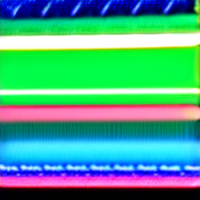
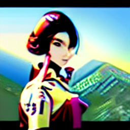
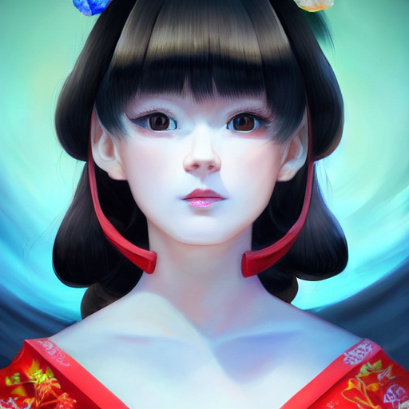
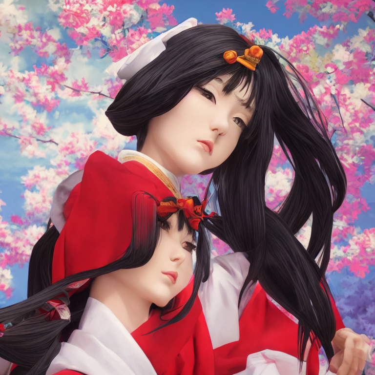

Is it necessary to retrain a diffusion model, to generate images smaller or larger than those in its training set?

On inspection, it seems so:

<figure class="table-fig">
  <table class="no-border-bottom">
    <thead>
      <th>200x200</th>
      <th>256x256</th>
      <th>512x512</th>
      <th>768x768</th>
    </thead>
    <tbody>
      <tr>
        <td></td>
        <td></td>
        <td></td>
        <td></td>
      </tr>
    </tbody>
  </table>
  <figcaption>Stable-diffusion 1.5. Optimal = 512. Smaller = deep-fried. Larger = duplication of body parts</figcaption>
</figure>

Stable-diffusion 1.x (and stable-diffusion 2.x-base) were trained on 512x512 images, encoded as 64x64 latents.

What specifically makes it perform poorly at different image sizes?